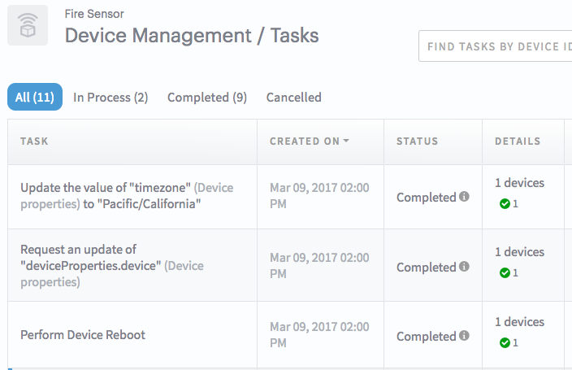

## <u>**Device Management API**</u>: Create a Task for <u>lwm2m clients</u>

This sample app will create a TaskRequest to ARTIK Cloud using the DevicesManagement Task API. 

The TaskRequests will be immediately scheduled to ARTIK Cloud and will act on any connected LWM2M clients.

## <u>Requirements:</u>

- [ARTIK Cloud Java SDK ](https://github.com/artikcloud/artikcloud-java)
- LWM2M Client Simulator from [LWM2M C Client SDK](https://github.com/artikcloud/artikcloud-lwm2m-c)
- Java >= 7

## <u>Setup / Installation:</u>

### Setup at ARTIK Cloud

 1. [Create a device type](https://developer.artik.cloud/documentation/tools/web-tools.html#creating-a-device-type) (or use the one you already own) in the [Developer Dashboard](https://developer.artik.cloud/).   

 2. Enable [Device Management Properties](https://developer.artik.cloud/documentation/advanced-features/device-management.html#device-management-in-the-developer-dashboard) for your device type. You do this in the [Device Type Dashboard](https://developer.artik.cloud/dashboard/devicetypes)—> Select Your Device Type —> Select Device Management —> Click "Enable Device Properties".

 3. At [My ARTIK Cloud](https://my.artik.cloud/), [Connect a device](https://developer.artik.cloud/documentation/tools/web-tools.html#connecting-a-device) (or use the one you already own) of the device type. Get the [device ID and token](https://developer.artik.cloud/documentation/tools/web-tools.html#managing-a-device-token), which you will need when running the example client later.

### Setup the Java project

**Clone this sample and import project to your IDE**

`%> git clone https://github.com/artikcloud/tutorial-java-deviceManagementLWM2MStarter`

**Import project and Install ARTIK Cloud Java SDK**

1.  Import the project into your IDE.   If you are using eclipse, import the project as an `existing maven project`.

2.  Install the [ARTIK Cloud Java SDK](https://github.com/artikcloud/artikcloud-java).   Use `maven`, or alternatively download jar file by searching for "artikcloud" at https://search.maven.org/  (ie: `artikcloud-java-2.0.7-jar-with-dependencies.jar` ) and import this jar file to your project.


**Update Config.java file**

Replace with your own Device Id and Device Type Id into the Config.java file.  Additionally add your [User Access Token](https://developer.artik.cloud/documentation/introduction/hello-world.html#step-2-get-an-access-token) to Config.java.   

### Setup the LWM2M Client Simulator

The [ARTIK Cloud LWM2M Client SDK for C]() client simulator is available as a sample program.  Client simulator will be used as a LWM2M device connection to ARTIK Cloud.

1. Build and run the [client simulator](https://github.com/artikcloud/artikcloud-lwm2m-c)

2. Connect your device with the LWM2M client simulator and supply the `device id` and `device token` as parameters.   **Keep this connection open**.  The LWM2M client simulator will output to console when it receives a task

   ```
   %> akc_client -n -u coaps://coaps-api.artik.cloud:5686 -d YOUR_DEVICE_ID -t YOUR_DEVICE_TOKEN
   ```

3. **The LWM2M client simulator will also output to console when it receives a task.**  Here are a couple commands to familiarize yourself with the client simulator.

   To read from **Object 3 / Resource 15** which is the <u>timezone property</u> of the device

   ```
   client%> read /3/0/15
   URI: /3/0/15 - Value: America/Los_Angeles
   ```

   You can `write` a property in similar fashion using the `change` command

   ```
   client%> change /3/0/15 Europe/Paris
   ```

   *Note:  Check out the [LWM2M documentation](https://developer.artik.cloud/documentation/advanced-features/manage-devices-using-lwm2m.html) for more information on object/resources

### Run the sample code:

**Run the QuickStartTasks.java file** which will send a read, write, and execute task.

#### Here is a sample response after sending a Task Request.

```javascript
//From callback success 
TaskEnvelope:class TaskEnvelope {
data: class Task {
    filter: null
    taskType: W
    modifiedOn: 1482279165339
    dtid: dtabcdef123456789000000
    statusCounts: class TaskStatusCounts {
        numFailed: 0
        numCancelled: 0
        totalDevices: 0
        numCompleted: 0
        numSucceeded: 0
    }
    property: deviceProperties.device.timezone
    id: <REDACTED-TASK-ID>
    dids: [<REDACTED-DEVICE-ID>]
    taskParameters: class TaskParameters {
        expiresAfter: 604800
        value: America/Los_Angeles
    }
    createdOn: 1482279165339
    status: REQUESTED
}
```

The connected LWM2M Client Simulator will also output to screen once it receives the Task.  Here we see it has received a command to reboot and the /3/0/15 resource has changed

```
$ ./akc_client -n -u coaps://coaps-api.artik.cloud:5686 -d yourdeviceid -t yourdevicetoken
> REBOOT
Resource Changed: /3/0/15
```

#### Task Dashboard

Checkout the Tasks you have called and their statuses within the [Device Type Dashboard](https://developer.artik.cloud/dashboard/devicetypes/)—> [Device Management](https://developer.artik.cloud/dashboard/devicetypes) —> Tasks Dashboard.

**Screenshot:**




## More examples

- Peek into [tests](https://github.com/artikcloud/artikcloud-java/tree/master/src/test/java/cloud/artik/api) in ARTIK Cloud Java SDK for more device management SDK usage examples.
- [Devices Management Starter Code](https://github.com/artikcloud/tutorial-java-deviceManagementStarterCode) learn to read and write to server properties.

## Device Management Resources

[Devices Management Java SDK API](https://github.com/artikcloud/artikcloud-java/blob/master/docs/DevicesManagementApi.md) 

[Devices Management REST API](https://developer.artik.cloud/documentation/api-reference/rest-api.html#device-management)

[Devices Management LWM2M - Java Client](https://github.com/artikcloud/artikcloud-lwm2m-java)

[Devices Management LWM2M - C Client](https://github.com/artikcloud/artikcloud-lwm2m-c)


More about ARTIK Cloud
----------------------

If you are not familiar with ARTIK Cloud, we have extensive documentation at https://developer.artik.cloud/documentation

The full ARTIK Cloud API specification can be found at https://developer.artik.cloud/documentation/api-reference/

Check out advanced sample applications at https://developer.artik.cloud/documentation/samples/

To create and manage your services and devices on ARTIK Cloud, create an account at https://developer.artik.cloud

Also see the ARTIK Cloud blog for tutorials, updates, and more: http://artik.io/blog/cloud


License and Copyright
---------------------

Licensed under the Apache License. See [LICENSE](https://github.com/artikcloud/artikcloud-java/blob/master/LICENSE).

Copyright (c) 2017 Samsung Electronics Co., Ltd.

